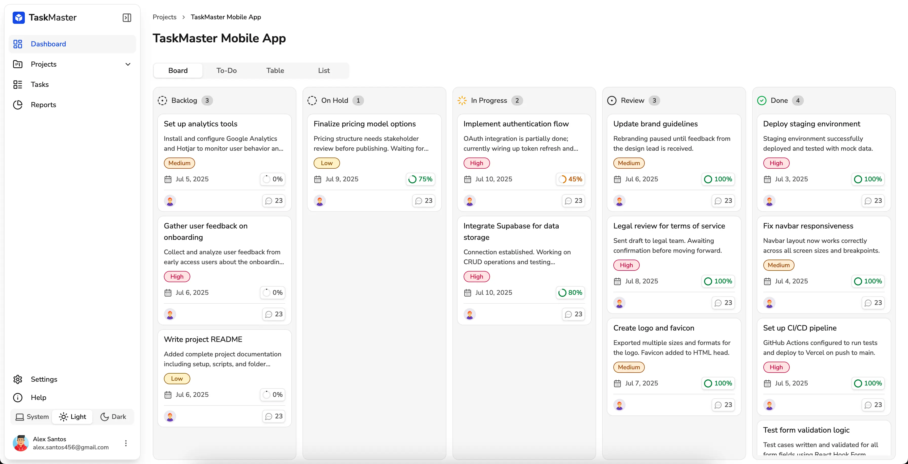
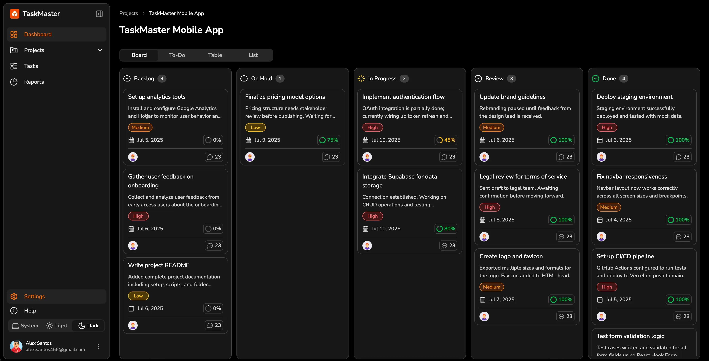

# Taskmaster

[](https://vitejs.dev/)
[](https://react.dev/)
[](https://www.typescriptlang.org/)
[](https://tailwindcss.com/)

## 📌 Overview

This project is a task manager to handle projects and daily tasks with multiple users with **React**.
(Note: This project is still in progress 👷‍♂️)

---

## 🛠 Getting Started

### ✅ Prerequisites

- Node.js `v18+`
- pnpm or npm

```bash
# Clone repo
git clone git@github.com:alexsantosquispe/taskmaster.git
cd taskmaster
```

```bash
# Install dependencies
pnpm install
or
npm install
```

```bash
# Run development server
pnpm run dev
or
npm run dev
```

Visit `http://localhost:5173` to view the app.

---

## 🖼️ Screenshots

### Light

<div style="display:flex; gap: 12px;">
  
</div>

### Dark

<div style="display:flex; gap: 12px;">
  
</div>

---
